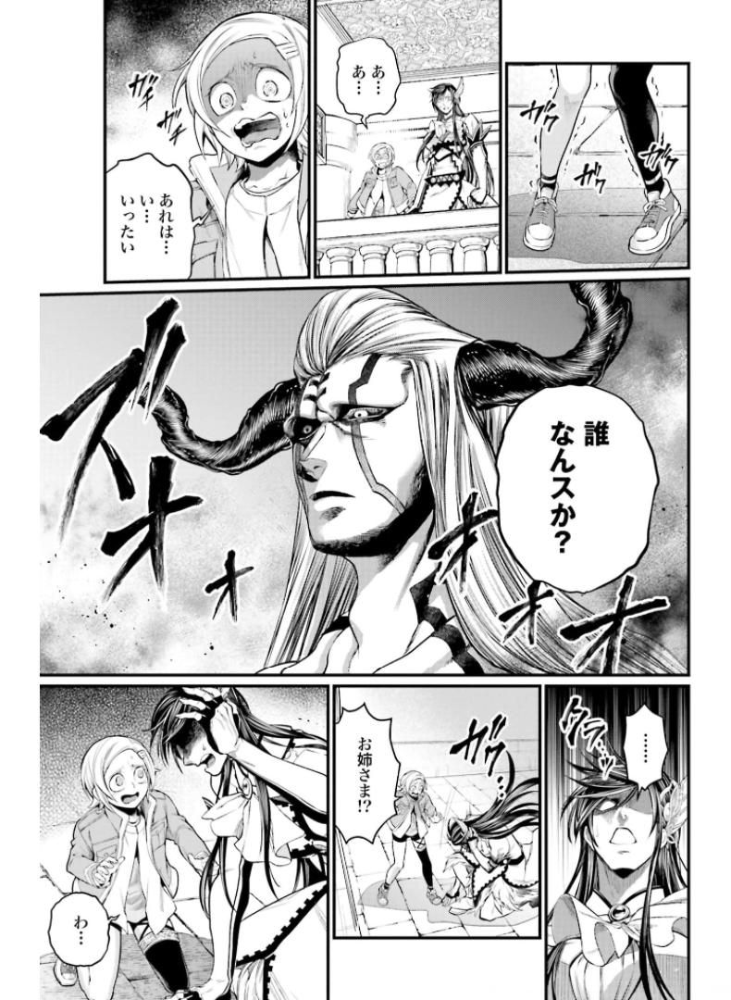
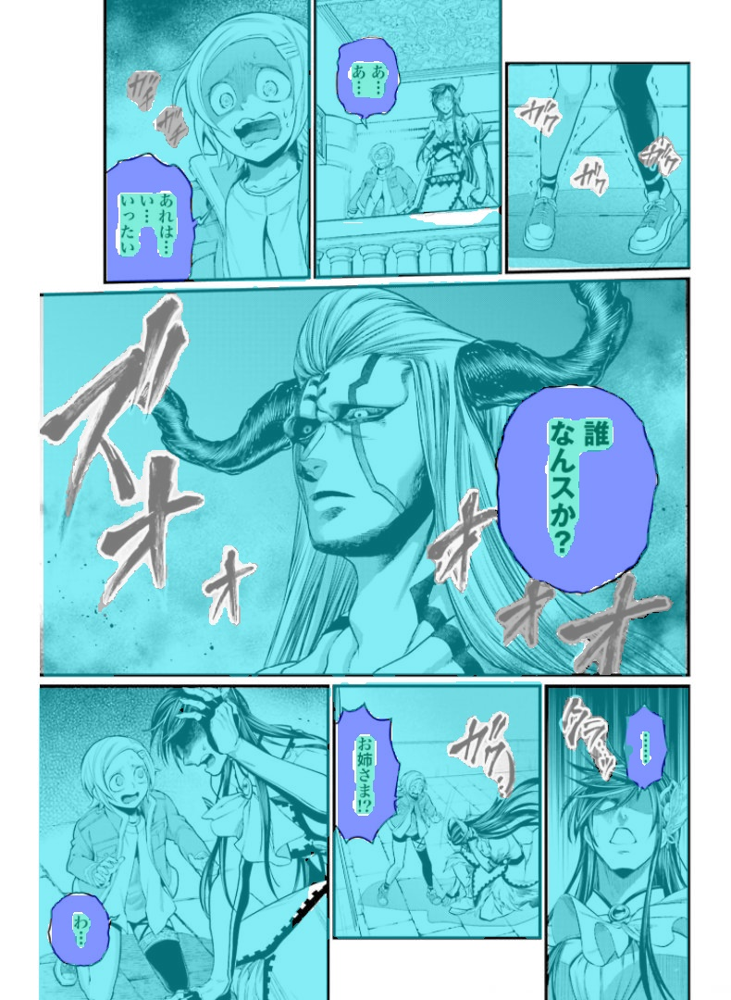

<div align="center">

# 🦾 Manga AI Detector (YOLOv11)


A custom fine-tuned **YOLOv11** object detection model engineered for **manga, manhwa, and comic book document analysis**.

</div>

---

# 🔍 Features

This model is fine-tuned to detect **4 structural elements** found in manga and comic pages:

| Class | Description |
|-------|-------------|
| 🖼️ **Panels** | Individual comic frames and borders |
| 💬 **Speech Bubbles** | Speech, thought, and dialogue containers |
| 📝 **Text** | Printed dialogue and captions |
| 💥 **SFX** | Stylized sound effects and lettering |

---
## 🖼️ Visual Results

| Input Page | Detections Output |
| :---: | :---: |
|  |  |
---
# 💻 Hardware Requirements

## Minimum (Inference)

- CPU: Quad-Core Intel or AMD Processor
- RAM: 8 GB
- GPU: Optional
  - NVIDIA GTX 1050 / GTX 1650 (4 GB VRAM recommended)
- Storage: 2 GB free space

## Recommended (Training)

- CPU: 8-Core Intel or AMD Processor
- RAM: 16 GB+
- GPU:
  - NVIDIA RTX 3060 / RTX 4060 or newer
  - 8 GB+ VRAM
- CUDA:
  - CUDA 11.8 or CUDA 12.x

---

# ⚙️ Installation

## Clone the Repository

```bash
git clone https://github.com/nonillion-studios/Manga-AI-detector.git
cd Manga-AI-detector
```

## Install Dependencies

Python **3.8+** is required.

```bash
pip install -r requirements.txt
```

---

# 📂 Repository Layout

```
Manga-AI-detector/
├── best.pt
├── inference.py
├── train.py
├── requirements.txt
├── LICENSE
├── README.md
└── .gitignore
```

| File | Description |
|------|-------------|
| `best.pt` | Fine-tuned YOLOv11 weights |
| `inference.py` | Batch inference helper |
| `train.py` | Fine-tuning script |
| `requirements.txt` | Python dependencies |
| `LICENSE` | Apache License 2.0 |
| `README.md` | Documentation |

---

# 🚀 Inference

## Option 1 — Python Script

```bash
python inference.py --source "path/to/manga_page.jpg" --conf 0.25 --save
```

---

## Option 2 — Ultralytics CLI

```bash
yolo detect predict \
    model=best.pt \
    source="path/to/manga_page.jpg" \
    conf=0.25 \
    save=True
```

---

## Option 3 — Python API

```python
from ultralytics import YOLO

# Load model
model = YOLO("best.pt")

# Run prediction
results = model.predict(
    source="manga_page.png",
    conf=0.25
)

# Display results
for result in results:
    result.show()
```

---

# 🎯 Fine-Tuning

## Step 1 — Create `data.yaml`

```yaml
path: ./dataset

train: images/train
val: images/val

names:
  0: panel
  1: bubble
  2: text
  3: sfx
```

---

## Step 2 — Train Using Python

```python
from ultralytics import YOLO

# Load pretrained weights
model = YOLO("best.pt")

# Continue training
model.train(
    data="data.yaml",
    epochs=50,
    imgsz=640,
    batch=16,
    device=0
)
```

---

## Or Train via CLI

```bash
yolo detect train \
    model=best.pt \
    data=data.yaml \
    epochs=50 \
    imgsz=640 \
    batch=16
```

---

# 📊 Supported Classes

| ID | Class |
|----|-------|
| 0 | Panel |
| 1 | Bubble |
| 2 | Text |
| 3 | SFX |

---

# 📦 Requirements

Main dependencies include:

- Python 3.8+
- Ultralytics YOLO
- PyTorch
- OpenCV
- NumPy

Install everything with:

```bash
pip install -r requirements.txt
```

---
## 🐳 Docker Setup & Usage

If you prefer using Docker to avoid environment and dependency issues:

### 1. Build the Docker Image

```bash
docker build -t manga-ai-detector .
```
--- 

### 2. Run Inference with Docker
Mount your local directory containing images to run inference on them:

```bash
docker run --rm \
  -v $(pwd)/data:/app/data \
  manga-ai-detector --source /app/data/manga_page.jpg --save
```
---
# 🤝 Contributing

Contributions are welcome!

If you'd like to improve the model or documentation:

1. Fork the repository.
2. Create a feature branch.
3. Commit your changes.
4. Open a Pull Request.

Bug reports and feature requests are also appreciated via GitHub Issues.

---

# 📄 License

This project is licensed under the **Apache License 2.0**.

You are free to use, modify, distribute, and incorporate this project into commercial or open-source software, provided that you comply with the terms of the Apache License 2.0.

For full license text, see the **LICENSE** file.

---

# 👤 Author

**Nonillion Studios**
**by : Mohamed M.Hamdy**
If you find this project useful, consider giving it a ⭐ on GitHub.

GitHub: https://github.com/nonillion-studios
